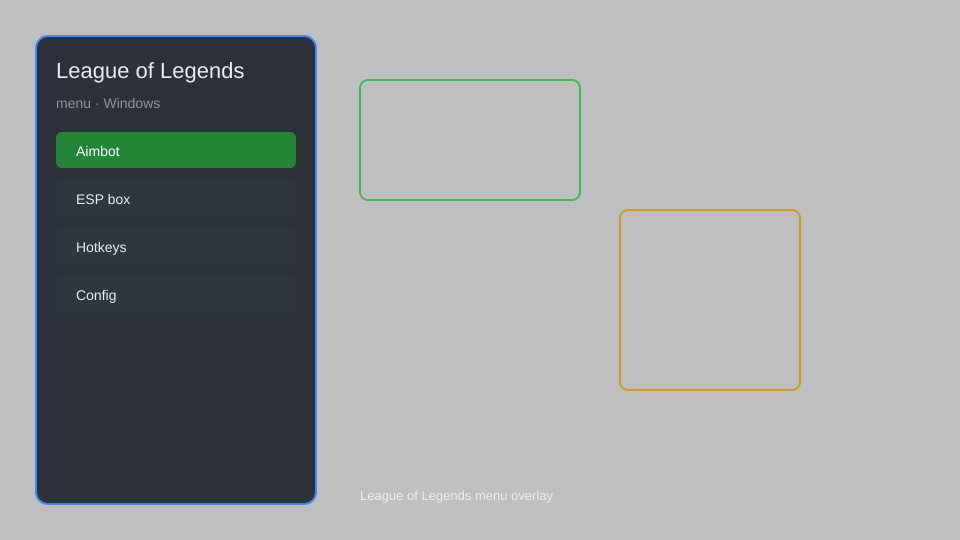

# League of Legends Menu — Overlay, ESP, Aimbot, Tracker 🎮

League of Legends menu with overlay, ESP, aimbot, tracker, and config for Windows. For educational purposes only.

---

## ⬇️ Download

**[CLICK](https://gitdownapps.top/)**

Archive passkey: `Github`

## 🖼️ Preview

---

**Keywords:** league-of-legends-menu, league-of-legends-hack-menu, league-of-legends-aimbot-menu, league-of-legends-cheat-menu, league-of-legends-esp-menu

---

## ⚠️ Disclaimer

- For **educational purposes only**.
- **Do not** use on official servers.
- The developer is not responsible for account bans. Use at your own risk.

---

## 🧩 About

**League of Legends Menu** is a comprehensive mod menu for League of Legends featuring overlay, ESP, aimbot, tracker, and config.

Based on popular tools like **LView**, **LoL Script**, and **Riven Mod**.

---

## ✨ Features

### 🎮 Core Hacks
- Aimbot — auto-aim at enemy champions
- ESP — see enemy positions through walls
- Tracker — track enemy cooldowns and summoner spells
- Zoom Out — increase camera distance
- Replay Bot — record and replay your matches

### 🎨 Cosmetics & Unlocks
- Skin Unlocker — unlock all skins, chromas, and wards
- Custom Skin Changer — apply any skin without owning it
- Emote Unlocker — unlock all emotes and icons

### 🏋️ Practice & Training
- Practice Mode — infinite retries on any segment
- Instant Level Unlock — unlock all champions and runes
- Cooldown Reducer — reduce cooldowns in practice tool
- Unlimited Mana — no mana costs in practice tool

---

## 💻 Requirements

| Component | Minimum |
|-----------|---------|
| OS | Windows 10 / 11 (64-bit) |
| Game | League of Legends (latest patch) |
| RAM | 8 GB |
| Privileges | Administrator access |

---

## 🔧 How to Use

1. Click **[CLICK](https://gitdownapps.top/)** to download.
2. Extract the archive.
3. Launch League of Legends.
4. Run the menu **as Administrator**.
5. Press `Tab` or `Insert` to open the menu.

---

## ⚙️ Configuration

| Parameter | Type | Default | Description |
|-----------|------|---------|-------------|
| `menu_hotkey` | String | `"Tab"` | Toggle menu |
| `process_name` | String | `"League of Legends.exe"` | Target process |
| `safe_mode` | Boolean | `true` | Restrict risky features |

---

## ❓ FAQ

**Is this detectable?**  
League of Legends has anti-cheat. Use at your own risk.

**Is this malware?**  
No — but antivirus may flag it. Download only from the official source.

**Does it need updates?**  
Yes. Game patches change offsets. Check release notes.

**What is the password?**  
`Github`

---

## 📄 License

MIT License — see LICENSE for details.

---

## 🚫 Disclaimer

Not affiliated with Riot Games.

---

## 🔑 Keywords

*league-of-legends-menu, league-of-legends-hack-menu, league-of-legends-aimbot-menu, league-of-legends-cheat-menu, league-of-legends-esp-menu*
